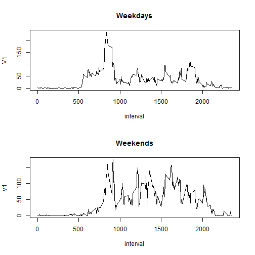

## Loading and preprocessing the data

```r
library(data.table)
```

```
## Warning: package 'data.table' was built under R version 3.1.3
```

```r
data<-fread("activity.csv")
```
## What is mean total number of steps taken per day?

```r
stepDay=data[,sum(steps,na.rm=TRUE),by=date]
summ<-summary(stepDay$V1)
hist(stepDay$V1,xlab="No. of Steps",main="Total number of steps taken each day")
```

 
  
Mean is **9354**  
Median **1.04 &times; 10<sup>4</sup>**  
## What is the average daily activity pattern?

```r
steptime=data[,mean(steps,na.rm=TRUE),by=interval]
maxi=steptime$interval[steptime$V1==max(steptime$V1)]
plot(steptime,type="l")
```

 
  
The 5-minute interval, on average across all the days in the dataset, which contains the maximum number of steps is **835**  
## Imputing missing values
### Missing Value Approximation-  
**Missing values in the *steps* variable in the  data are replaced by the average number of steps taken, averaged across all days.** 


```r
no=table(is.na(data$steps))[2]
datanew=data
datanew$steps[is.na(datanew$steps)]=steptime$V1[is.na(datanew$steps)]
stepDayn=datanew[,sum(steps),by=date]
summn<-summary(stepDayn$V1)
hist(stepDayn$V1,xlab="No. of Steps",main="Total number of steps taken each day(New)")
```

 
  
Number of missing values are 2304  
New Mean is **1.077 &times; 10<sup>4</sup>**  
New Median **1.077 &times; 10<sup>4</sup>**  
As it can be seen the Mean remains same and the Median has changed.
## Are there differences in activity patterns between weekdays and weekends?

```r
datanew$days=weekdays(as.Date(datanew$date)) %in% c("Sunday","Saturday")
datanew$days=factor(datanew$days)
attr(datanew$days,"levels")=c("weekdays","weekends")
dataday=datanew[c(datanew$days=="weekdays")]
dataend=datanew[c(datanew$days=="weekends")]
steptimeday=dataday[,mean(steps,na.rm=TRUE),by=interval]
steptimeend=dataend[,mean(steps,na.rm=TRUE),by=interval]
par(mfrow=c(2,1))
plot(steptimeday,type="l",main="Weekdays")
plot(steptimeend,type="l",main="Weekends")
```

 


